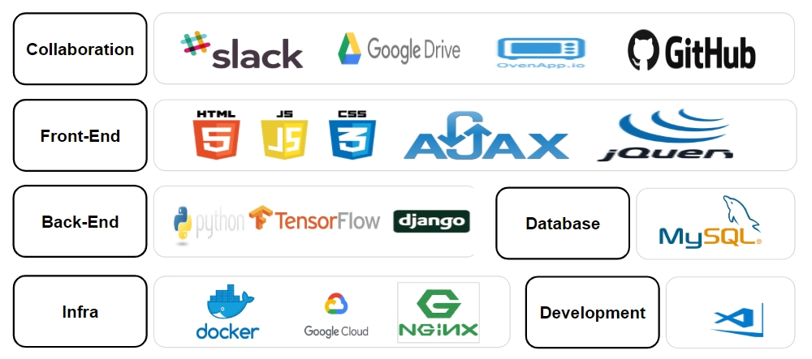

# 프로젝트 개요
* 개인화 음성 합성 기술 TTS(Text to Speech)를 기반으로 목소리를 분석해 학습된 목소리로 글을 읽어주는 웹 서비스
* Text2Speech를 구현한 Django Project
* Model : tacotron 사용

# Team Project Overview
* https://github.com/brainmining-for-bigdata/project-text2speech-blog

## 사용된 기술



## Project 실행 방법
1. git clone  
2. Database생성-  user: root pw: 1234 
```
mysql> create database maratron;
mysql> show databases;
```
3. default table, tts App 내 DB 모델 생성 및 반영  
```
python manage.py migrate
반영 여부 확인
python manage.py showmigrations tts
강제로 migrate할 때 
python manage.py migrate --fake tts zero

superUser 계정 생성
python manage.py createsuperuser
서버 구동하여 admin 페이지 정상 접속 여부 확인
python manage.py runserver
```

4. Python manage.py run 
5. web browser 접속  
http://127.0.0.1:8000/admin/

## commands 

### Preprocess the data
python preprocess.py --dataset ljspeech

### Train a model
python train.py

### Continue training from the the checkpoint
python train.py --restore_step=9000

### Monitor with Tensorboard
tensorboard --logdir ~/tacotron/logs-tacotron

### Evaluate 
python eval.py --checkpoint ~/tacotron/logs-tacotron/model.ckpt-185000


### Make audio book
python eval.py   --checkpoint  ./logs-tacotron-model/model.ckpt-64000 --cleaners korean_cleaners --audiobook ./audiobooks/이기적유전자.txt
python eval.py   --checkpoint ./LJlogs-tacotron/model.ckpt-40000 --audiobook ./audiobooks/Secret.txt

### add audiobook into database
python initdata.py

### Run a server
python manage.py runserver


## 프로젝트 파일 구조

```
│  .gitignore
│  cors-json-file.json
│  demo_server.py
│  docker-compose.yml
│  Dockerfile
│  eval.py
│  hparams.py
│  initdata.py
│  manage.py
│  outtext.txt
│  preprocess.py
│  README.md
│  requirements.txt
│  synthesizer.py
│  train.py
├─audio
├─audiobooks
│      Secret.txt
│      Secret.wav
│      Tomorrow.txt
│      Tomorrow.wav
│      Universe.txt
│      Universe.wav
│      무소유.txt
│      무소유.wav
│      이기적유전자.txt
│      이기적유전자.wav
│      호랑이.txt
│      호랑이.wav
├─california-12-logs
│      model.ckpt-112000.data-00000-of-00001
│      model.ckpt-112000.index
│      model.ckpt-112000.meta
├─datasets
│  │  blizzard.py
│  │  california.py
│  │  datafeeder.py
│  │  KoSpeech.py
│  │  ljspeech.py
│  │  ljspeech_ko.py
│  │  __init__.py
│  └─__pycache__
├─KoTextProcessing
│  │  HangulUtils.py
│  │  KoG2P.py
│  │  rulebook.txt
│  │  TextPreprocessing.py
│  │  Vietnamese_text_processing.py
│  │  __init__.py
│  └─__pycache__
├─LJlogs-tacotron
│      model.ckpt-40000.data-00000-of-00001
│      model.ckpt-40000.index
│      model.ckpt-40000.meta
├─logs-tacotron
│      model.ckpt-28000.data-00000-of-00001
│      model.ckpt-28000.index
│      model.ckpt-28000.meta
├─logs-tacotron-model
│      model.ckpt-64000.data-00000-of-00001
│      model.ckpt-64000.index
│      model.ckpt-64000.meta
├─media
│  ├─audio
│  │      Secret.wav
│  │      Tomorrow.wav
│  │      Universe.wav
│  │      무소유.wav
│  │      이기적유전자.wav
│  │      호랑이.wav
│  ├─contents
│  │      Secret.txt
│  │      Tomorrow.txt
│  │      Universe.txt
│  │      무소유.txt
│  │      이기적유전자.txt
│  │      호랑이.txt
│  └─thumnail
│          img1.png
│          img2.png
│          img3.png
│          img4.png
│          img5.png
│          img6.png
├─models
│  │  helpers.py
│  │  modules.py
│  │  rnn_wrappers.py
│  │  tacotron.py
│  │  __init__.py
│  └─__pycache__
├─nginx
│      nginx.conf
├─recognition
│      google.py
├─src
├─static
│  ├─audio
│  │      eng_version.wav
│  │      kor_version.wav
│  │      output.wav
│  ├─css
│  ├─img
│  │  └─audiostore
│  ├─js
│  ├─svg
│  └─webfonts
├─static_root
│  ├─admin
│  ├─audio
│  │      eng_version.wav
│  │      kor_version.wav
│  │      output.wav
│  ├─css
│  ├─django_extensions
│  │  ├─css
│  │  ├─img
│  │  └─js
│  ├─img
│  ├─js
│  ├─svg
│  └─webfonts
├─tests
├─text
│  │  cleaners.py
│  │  cmudict.py
│  │  numbers.py
│  │  symbols.py
│  │  __init__.py
│  └─__pycache__
├─tts
│  │  admin.py
│  │  apps.py
│  │  models.py
│  │  tests.py
│  │  urls.py
│  │  views.py
│  │  __init__.py
│  │
│  ├─migrations
│  │  │  0002_initial.py
│  │  │  __init__.py
│  │  │
│  │  └─__pycache__
│  ├─templates
│  │  └─tts
│  │          index.html
│  └─__pycache__
├─ttsProject
│  │  settings.py
│  │  urls.py
│  │  wsgi.py
│  │  __init__.py
│  └─__pycache__
├─util
│  │  audio.py
│  │  infolog.py
│  │  plot.py
│  │  __init__.py
│  │
│  └─__pycache__
└─__pycache__


```
